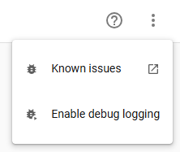

[![GitHub Release][releases-shield]][releases]
[![GitHub Activity][commits-shield]][commits]
[![License][license-shield]](LICENSE)
![Project Maintenance][maintenance-shield]

[](https://www.paypal.me/cyberjunkynl/)
[](https://github.com/sponsors/cyberjunky)

# Garmin Connect

Integrate your Garmin Connect fitness data with Home Assistant. Access **110+ sensors** covering health metrics, activities, body composition, and gear tracking—plus add measurements directly to Garmin Connect via services.

## Supported Features

- **Health Metrics** - Steps, calories, heart rate, stress, sleep, body battery, SpO2
- **Body Composition** - Weight, BMI, body fat, muscle mass, hydration
- **Fitness Tracking** - Activities, intensity minutes, fitness age, endurance score
- **Gear Management** - Track usage of shoes, bikes, and other equipment
- **Services** - Add body composition and blood pressure data, manage gear defaults

## Available Sensors

> **Note:** All sensors are enabled by default. You can disable sensors using Home Assistant's sensor configuration.
Sensor values depend on your Garmin devices and connected apps.

### Activity & Steps

| Sensor | Description |
|--------|-------------|
| Total Steps | Daily step count |
| Daily Step Goal | Your configured step target |
| Yesterday Steps/Distance | Previous day's complete totals |
| Weekly Step/Distance Avg | 7-day averages |
| Total Distance | Distance walked/run in meters |
| Floors Ascended/Descended | Floors climbed |

### Calories & Nutrition

| Sensor | Description |
|--------|-------------|
| Total/Active/BMR Calories | Daily calorie metrics |
| Burned/Consumed Calories | Calorie tracking |

### Heart Rate

| Sensor | Description |
|--------|-------------|
| Resting Heart Rate | Daily resting HR |
| Min/Max Heart Rate | Daily HR range |
| Last 7 Days Avg HR | Weekly average |
| HRV Weekly/Nightly Avg | Heart rate variability metrics |
| HRV Baseline | Personal HRV baseline |

### Stress & Recovery

| Sensor | Description |
|--------|-------------|
| Avg/Max Stress Level | Stress measurements (0-100) |
| Stress Durations | Time in rest/activity/low/medium/high stress |

### Sleep

| Sensor | Description |
|--------|-------------|
| Sleep Score | Overall sleep quality score |
| Sleep/Awake Duration | Time asleep and awake |
| Deep Sleep | Time in deep sleep |
| Light Sleep | Time in light sleep |
| REM Sleep | Time in REM sleep |

### Body Battery

| Sensor | Description |
|--------|-------------|
| Body Battery Most Recent | Current energy level (0-100) |
| Charged/Drained | Energy gained/spent |
| Highest/Lowest | Daily peak and low |

### Body Composition

| Sensor | Description |
|--------|-------------|
| Weight/BMI | Body weight and mass index |
| Body Fat/Water | Percentage measurements |
| Muscle/Bone Mass | Mass measurements |
| Metabolic Age | Estimated metabolic age |

### Hydration

| Sensor | Description |
|--------|-------------|
| Hydration | Daily water intake (ml) |
| Hydration Goal | Target intake |
| Sweat Loss | Estimated fluid loss |

### Blood Pressure

| Sensor | Description |
|--------|-------------|
| Systolic | Systolic blood pressure (mmHg) |
| Diastolic | Diastolic blood pressure (mmHg) |
| Pulse | Pulse from blood pressure reading (bpm) |
| Measurement Time | When the BP was measured |

### Health Monitoring

| Sensor | Description |
|--------|-------------|
| SpO2 (Avg/Low/Latest) | Blood oxygen levels |
| HRV Status | Heart rate variability |
| Respiration Rate | Breathing measurements |

### Fitness & Performance

| Sensor | Description |
|--------|-------------|
| Fitness Age | Estimated fitness age |
| Chronological Age | Your actual age |
| Endurance Score | Overall endurance rating |

### Activity Tracking

| Sensor | Description |
|--------|-------------|
| Next Alarm | Next scheduled alarm time |
| Last Activity/Activities | Recent activity info |
| Badges/User Points/Level | Gamification metrics |

### Menstrual Cycle Tracking

| Sensor | Description |
|--------|-------------|
| Cycle Phase | Current menstrual phase |
| Cycle Day | Day of the current cycle |
| Period Day | Day of the period |
| Cycle Length | Total cycle length (days) |
| Period Length | Period length (days) |

> **Note:** Menstrual cycle sensors are only available if tracking is enabled in your Garmin Connect account.

### Gear Tracking

Gear sensors are dynamically created for each piece of equipment registered in Garmin Connect (shoes, bikes, etc.). They track total distance and usage statistics.

## Screenshots


## Requirements

- A Garmin Connect account.
- A device that syncs to the Garmin Connect website.

### HACS (Recommended)

[](https://my.home-assistant.io/redirect/hacs_repository/?owner=cyberjunky&repository=home-assistant-garmin_connect&category=integration)

Alternatively:

1. Install [HACS](https://hacs.xyz) if not already installed
2. Search for "Garmin Connect" in HACS
3. Click **Download**
4. Restart Home Assistant
5. Add via Settings → Devices & Services

### Manual Installation

1. Copy `custom_components/garmin_connect` to your `<config>/custom_components/` directory
2. Restart Home Assistant
3. Add via Settings → Devices & Services

## Configuration

### Adding the Integration

1. Navigate to **Settings** → **Devices & Services**
2. Click **+ Add Integration**
3. Search for **"Garmin Connect"**
4. Enter your configuration:
   - **Username**: Your Garmin Connect username
   - **Password**: Your Garmin Connect password
   - **MFA Code**: Your Garmin Connect MFA code (optional)

## Advanced Usage

### Automation Examples

**Add Body Composition**

```yaml
action: garmin_connect.add_body_composition
data:
  weight: 87
  bmi: 25.5
  bone_mass: 4.8
```

See the action template for other available values to add.

**Withings scale data to Garmin**

```yaml
alias: WithingsToGarmin
description: Sync weight from Withings to Garmin Connect
triggers:
  - trigger: state
    entity_id:
      - sensor.withings_weight
conditions:
  - condition: numeric_state
    entity_id: sensor.withings_weight
    above: 55
    below: 100
actions:
  - action: garmin_connect.add_body_composition
    data:
      weight: "{{ states('sensor.withings_weight') }}"
      timestamp: "{{ now().isoformat() }}"
      bmi: >-
        {{ (states('sensor.withings_weight') | float(0) / 1.72**2) | round(1) }}
      bone_mass: "{{ states('sensor.withings_bone_mass') }}"
      muscle_mass: "{{ states('sensor.withings_muscle_mass') }}"
      percent_fat: "{{ states('sensor.withings_fat_ratio') }}"
mode: single
```

**Set Active Gear**

```yaml
action: garmin_connect.set_active_gear
target:
  entity_id: sensor.garmin_connect_adidas
data:
  activity_type: running
  setting: set as default
```

**Add Blood Pressure**

```yaml
action: garmin_connect.add_blood_pressure
data:
  systolic: 120
  diastolic: 80
  pulse: 60
  timestamp: "2025-01-21T07:34:00"
  notes: Measured with Beurer BC54
```

**Create Activity**

Creates an activity in Garmin Connect:

```yaml
action: garmin_connect.create_activity
data:
  activity_name: "Morning Run"
  activity_type: running
  start_datetime: "2025-01-21T08:30:00"
  duration_min: 30
  distance_km: 5.0
```

**Upload Activity**

Uploads an activity file (FIT, GPX, TCX) to Garmin Connect:

```yaml
action: garmin_connect.upload_activity
data:
  file_path: "morning_run.fit"
```

**Add Gear to Activity**

Associates gear (shoes, bike, etc.) with a specific activity:

```yaml
action: garmin_connect.add_gear_to_activity
data:
  activity_id: 12345678901
  gear_uuid: "abc12345-def6-7890-ghij-klmn12345678"
```

**Automatically assign alternate running shoes after a run**

```yaml
automation:
  - alias: "Assign alternate shoes to last running activity"
    trigger:
      - platform: state
        entity_id: sensor.garmin_connect_last_activity
    condition:
      - condition: template
        value_template: "{{ state_attr('sensor.garmin_connect_last_activity', 'activityType') == 'running' }}"
    action:
      - service: garmin_connect.add_gear_to_activity
        data:
          activity_id: "{{ state_attr('sensor.garmin_connect_last_activity', 'activityId') }}"
          gear_uuid: "{{ state_attr('sensor.garmnin_connect_adidas', 'gear_uuid') }}"
```

### Enable Debug Logging

Add the relevant lines below to the `configuration.yaml`:

```yaml
logger:
  default: info
  logs:
    custom_components.garmin_connect: debug
```

Alternatively, enable debug logging via the UI in **Settings** → **Devices & Services** → **Garmin Connect** → **Enable debug logging**:



Then perform any steps to reproduce the issue and disable debug logging again. It will download the relevant log file automatically.

## Development

Quick-start (from project root):

```bash
python3 -m venv .venv
source .venv/bin/activate
python -m pip install --upgrade pip
pip install -r requirements_lint.txt
./scripts/lint    # runs pre-commit + vulture
# or: ruff check .
# to auto-fix: ruff check . --fix
```

## 💖 Support This Project

If you find this library useful for your projects, please consider supporting its continued development and maintenance:

### 🌟 Ways to Support

- **⭐ Star this repository** - Help others discover the project
- **💰 Financial Support** - Contribute to development and hosting costs
- **🐛 Report Issues** - Help improve stability and compatibility
- **📖 Spread the Word** - Share with other developers

### 💳 Financial Support Options

[](https://www.paypal.me/cyberjunkynl/)
[](https://github.com/sponsors/cyberjunky)

**Why Support?**

- Keeps the project actively maintained
- Enables faster bug fixes and new features
- Supports infrastructure costs (testing, AI, CI/CD)
- Shows appreciation for hundreds of hours of development

Every contribution, no matter the size, makes a difference and is greatly appreciated! 🙏

## License

This project is licensed under the MIT License - see the [LICENSE](LICENSE) file for details.

---

[releases-shield]: https://img.shields.io/github/release/cyberjunky/home-assistant-garmin_connect.svg?style=for-the-badge
[releases]: https://github.com/cyberjunky/home-assistant-garmin_connect/releases
[commits-shield]: https://img.shields.io/github/commit-activity/y/cyberjunky/home-assistant-garmin_connect.svg?style=for-the-badge
[commits]: https://github.com/cyberjunky/home-assistant-garmin_connect/commits/main
[license-shield]: https://img.shields.io/github/license/cyberjunky/home-assistant-garmin_connect.svg?style=for-the-badge
[maintenance-shield]: https://img.shields.io/badge/maintainer-cyberjunky-blue.svg?style=for-the-badge
