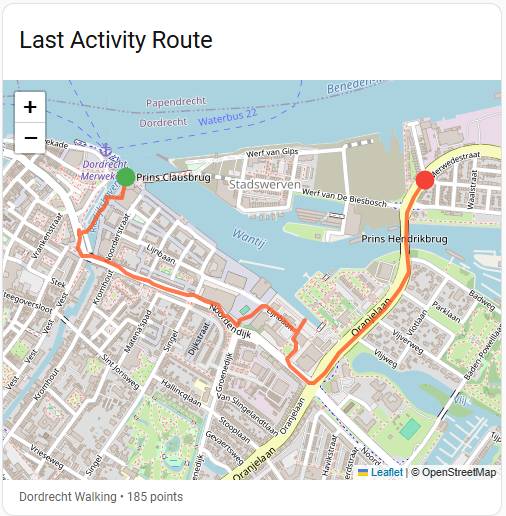

[![GitHub Release][releases-shield]][releases]
[![GitHub Activity][commits-shield]][commits]
[![License][license-shield]](LICENSE)
![Project Maintenance][maintenance-shield]

[](https://www.paypal.me/cyberjunkynl/)
[](https://github.com/sponsors/cyberjunky)

# Garmin Connect

> **v3.0 — Complete rewrite**
>
> This release is a ground-up rewrite of the integration to prepare for inclusion in Home Assistant Core. It uses the new [`ha-garmin`](https://pypi.org/project/ha-garmin/) library, replaces the old authentication method, and restructures all sensors to follow HA conventions.
>
> **What this means for you:**
> - **Re-authentication required** — The old OAuth tokens are not compatible with the new library. After updating you will be prompted to re-authenticate each configured Garmin account.
> - **Entity IDs are preserved** — The migration automatically updates internal identifiers so your existing dashboards and automations keep working. Some sensors have been renamed or replaced; any that no longer exist will simply disappear.
> - **Many new sensors** — 130+ sensors (up from ~100), including HRV details, training metrics, blood pressure, menstrual cycle tracking, and more.

The **Garmin Connect** integration connects your [Garmin Connect](https://connect.garmin.com/) cloud service to Home Assistant, enabling users to monitor their health and fitness data from Garmin wearable devices directly in Home Assistant.

The integration provides **130+ sensors** across the following categories:

- **Daily health metrics** — Steps, distance, floors climbed, calories burned
- **Heart rate monitoring** — Resting, min, max, and 7-day average heart rate
- **HRV (Heart Rate Variability)** — Status, weekly/nightly averages, baseline metrics
- **Stress tracking** — Average/max stress levels, stress duration breakdowns
- **Sleep analysis** — Total sleep, deep/light/REM sleep, sleep score
- **Body Battery** — Current level, charged/drained values
- **Body composition** — Weight, BMI, body fat, muscle mass, bone mass, hydration
- **Training metrics** — Training readiness, training status, lactate threshold, endurance/hill scores
- **Activities & workouts** — Last activity, recent activities list, workout tracking
- **Goals & badges** — Active/future goals, goal history, earned badges
- **Blood pressure** — Systolic, diastolic, pulse measurements
- **Menstrual cycle tracking** — Cycle phase, day, fertile window (disabled by default)
- **Gear tracking** — Dynamic sensors for shoes, bikes, and other equipment
- **Hydration** — Daily intake, goals, sweat loss


## Prerequisites

- A [Garmin Connect](https://connect.garmin.com/) account
- At least one Garmin device synced to your account
- If you have MFA (Multi-Factor Authentication) enabled, you'll need access to your authentication method during setup

## Installation

### HACS (Recommended)

[](https://my.home-assistant.io/redirect/hacs_repository/?owner=cyberjunky&repository=home-assistant-garmin_connect&category=integration)

Alternatively:

1. Install [HACS](https://hacs.xyz) if not already installed
2. Search for "Garmin Connect" in HACS
3. Click **Download**
4. Restart Home Assistant
5. Add via **Settings** → **Devices & Services**

### Manual Installation

1. Copy `custom_components/garmin_connect` to your `<config>/custom_components/` directory
2. Restart Home Assistant
3. Add via **Settings** → **Devices & Services**

## Configuration

1. Navigate to **Settings** → **Devices & Services**
2. Click **+ Add Integration**
3. Search for **"Garmin Connect"**
4. Enter your Garmin Connect email and password
5. If MFA is enabled, enter the verification code when prompted

### Options

After setup, configure these options via the integration's **Configure** button:

| Option | Default | Description |
|--------|---------|-------------|
| Scan interval | 300 | How often to fetch data in seconds (60–3600) |

## Data updates

The integration uses cloud polling to fetch data from Garmin Connect servers. Data is refreshed based on the configured scan interval (default: 5 minutes). Eight independent coordinators fetch data in parallel:

| Coordinator | Data |
|-------------|------|
| Core | Steps, distance, calories, heart rate, stress, sleep, body battery, SpO2, respiration, intensity |
| Activity | Last activity, recent activities, workouts |
| Training | Training readiness/status, HRV, lactate threshold, endurance/hill scores |
| Body | Weight, BMI, body fat, muscle mass, hydration, fitness age |
| Goals | Active/future goals, goal history, badges, user points |
| Gear | Shoes, bikes, equipment usage and distance |
| Blood Pressure | Systolic, diastolic, pulse |
| Menstrual | Cycle phase, day, fertile window |

> **Tip:** Garmin devices sync to Garmin Connect when in Bluetooth range of the paired phone or via WiFi. Sensors update after your device syncs to Garmin Connect **and** the integration polls for new data.

## Sensors

All sensors are created under a single "Garmin Connect" device. Entity IDs follow the pattern `sensor.garmin_connect_[sensor_name]`.

> **Note:** Most sensors are enabled by default. Menstrual cycle sensors are disabled by default and can be enabled in the entity settings. Sensor values depend on your Garmin devices and connected apps — not all data may be available for your account.

### Activity & Steps

| Sensor | Description |
|--------|-------------|
| Steps | Daily step count |
| Daily Step Goal | Your configured step target |
| Distance | Distance walked/run in meters |
| Yesterday Steps / Distance | Previous day's complete totals |
| Weekly Step / Distance Avg | 7-day averages |
| Floors Ascended / Descended | Floors climbed and descended |
| Floors Ascended Distance | Vertical distance climbed in meters |

### Calories

| Sensor | Description |
|--------|-------------|
| Calories | Total daily calories |
| Active Calories | Calories from activity |
| BMR Calories | Basal metabolic rate calories |
| Burned / Consumed / Remaining Calories | Calorie tracking |

### Heart Rate

| Sensor | Description |
|--------|-------------|
| Resting Heart Rate | Daily resting HR |
| Min / Max Heart Rate | Daily HR range |
| 7-Day Average Resting Heart Rate | Weekly resting HR average |
| Min / Max Average Heart Rate | Average min/max HR |
| Abnormal Heart Rate Alerts | Count of abnormal HR alerts |

### HRV (Heart Rate Variability)

| Sensor | Description |
|--------|-------------|
| HRV Status | Current HRV status (balanced, low, etc.) |
| HRV Weekly Average | 7-day HRV average |
| HRV Last Night Average | Overnight HRV average |
| HRV Last Night 5-Min High | Peak 5-minute HRV during sleep |
| HRV Baseline | Personal HRV baseline range |

### Stress & Recovery

| Sensor | Description |
|--------|-------------|
| Average / Max Stress Level | Stress measurements |
| Stress Qualifier | Overall stress descriptor |
| Total Stress Duration | Total time in stress |
| Rest / Activity / Low / Medium / High Stress Duration | Duration breakdowns |
| Stress Percentage | Percentage breakdowns by category |

### Sleep

| Sensor | Description |
|--------|-------------|
| Sleep Score | Overall sleep quality score |
| Sleep Duration | Total time asleep |
| Awake Duration | Time awake during sleep |
| Deep / Light / REM Sleep | Time in each sleep stage |
| Nap Time | Daytime nap duration |
| Unmeasurable Sleep | Unclassified sleep time |

### Body Battery

| Sensor | Description |
|--------|-------------|
| Body Battery | Current energy level (0–100) |
| Charged / Drained | Energy gained and spent |
| Highest / Lowest | Daily peak and low |

### Body Composition

| Sensor | Description |
|--------|-------------|
| Weight | Body weight in kg |
| BMI | Body Mass Index |
| Body Fat / Body Water | Percentage measurements |
| Muscle Mass / Bone Mass | Mass measurements in kg |
| Visceral Fat | Visceral fat percentage |
| Physique Rating | Body physique rating |
| Metabolic Age | Estimated metabolic age |

### Hydration

| Sensor | Description |
|--------|-------------|
| Hydration | Daily water intake (ml) |
| Hydration Goal | Target intake |
| Hydration Daily Average | Average daily intake |
| Hydration Sweat Loss | Estimated fluid loss |
| Hydration Activity Intake | Intake during activities |

### Blood Pressure

| Sensor | Description |
|--------|-------------|
| Systolic | Systolic blood pressure (mmHg) |
| Diastolic | Diastolic blood pressure (mmHg) |
| Pulse | Pulse from blood pressure reading (bpm) |

### Health Monitoring

| Sensor | Description |
|--------|-------------|
| Average / Lowest / Latest SpO2 | Blood oxygen levels |
| Latest SpO2 Time | When SpO2 was last measured |
| Highest / Lowest / Latest Respiration | Breathing rate (brpm) |
| Latest Respiration Time | When respiration was last measured |
| Average Altitude | Average monitoring altitude |

### Fitness & Training

| Sensor | Description |
|--------|-------------|
| Fitness Age / Achievable / Previous Fitness Age | Estimated fitness ages |
| Chronological Age | Your actual age |
| Endurance Score | Overall endurance rating |
| Hill Score | Hill running/climbing score |
| Training Readiness | Training readiness score (%) |
| Morning Training Readiness | Wake-up readiness score (%) |
| Training Status | Current training status phrase |
| VO2 Max | Most recent VO2 Max value (mL/(kg·min)) |
| Lactate Threshold HR | Lactate threshold heart rate (bpm) |
| Lactate Threshold Speed | Lactate threshold pace (m/s) |
| Next Alarm | Next scheduled alarm time |

### Goals & Achievements

| Sensor | Description |
|--------|-------------|
| Active Goals | Number of in-progress goals with progress |
| Future Goals | Upcoming scheduled goals |
| Goals History | Last 10 completed goals with status |
| Badges | Total badges earned |
| User Points / User Level | Gamification metrics |

> Goal sensors include detailed attributes: `goalType`, `targetValue`, `currentValue`, `progressPercent`, `startDate`, `endDate`, and `activityType`.

### Activity Tracking

| Sensor | Description |
|--------|-------------|
| Last Activity | Most recent activity with details |
| Last Activities | Recent activities list (attributes) |
| Last Workout / Workouts | Scheduled/planned training sessions |
| Last Synced | Last device sync timestamp |

### Blood Pressure

> Requires a Garmin blood pressure device (e.g., Index BPM). Sensors are populated from the most recent measurement.

| Sensor | Description |
|--------|-------------|
| Blood Pressure Systolic | Systolic blood pressure (mmHg) |
| Blood Pressure Diastolic | Diastolic blood pressure (mmHg) |
| Blood Pressure Pulse | Pulse from blood pressure reading (bpm) |
| Blood Pressure Category | Category name (e.g., Normal, Elevated) |
| Blood Pressure Measurement Time | Local timestamp of the measurement |

### Menstrual Cycle Tracking

| Sensor | Description |
|--------|-------------|
| Cycle Phase | Current menstrual phase |
| Cycle Day | Day of the current cycle |
| Cycle Type | Type of cycle tracking |
| Cycle Start | Start date of current cycle |
| Period Length | Period length (days) |
| Days Until Next Phase | Days remaining in current phase |
| Fertile Window Start / End | Predicted fertile window |
| Next Predicted Cycle Start | Predicted start of next cycle |

> Menstrual cycle sensors are disabled by default and only available if tracking is enabled in your Garmin Connect account.

### Gear Tracking

Gear sensors are dynamically created for each piece of equipment registered in Garmin Connect (shoes, bikes, etc.). They track total distance in meters and include attributes like `gear_uuid`, `total_activities`, `gear_make_name`, `gear_model_name`, and `default_for_activity`.

## Activity Route Map

The `Last Activity` sensor includes a `polyline` attribute with GPS coordinates when the activity has GPS data (`hasPolyline: true`). This can be displayed on a map using the included custom Lovelace card.

**Installation:**

1. Copy `www/garmin-polyline-card.js` to your `<config>/www/` folder
2. Add as a resource: **Settings → Dashboards → ⋮ → Resources → Add Resource**
   - URL: `/local/garmin-polyline-card.js`
   - Type: JavaScript Module
3. Hard refresh your browser (Ctrl+Shift+R)

**Usage:**

```yaml
type: custom:garmin-polyline-card
entity: sensor.garmin_connect_last_activity
attribute: polyline
title: Last Activity Route
height: 400px
color: "#FF5722"
```

| Option | Default | Description |
|--------|---------|-------------|
| `entity` | (required) | Sensor entity with polyline attribute |
| `attribute` | `polyline` | Attribute containing GPS coordinates |
| `title` | `Activity Route` | Card title |
| `height` | `300px` | Map height |
| `color` | `#FF5722` | Route line color |
| `weight` | `4` | Route line thickness |



## Actions (Services)

### garmin_connect.set_active_gear

Set gear as the default for an activity type.

| Parameter | Required | Description |
|-----------|----------|-------------|
| `gear_uuid` | No* | UUID of the gear (from sensor attributes) |
| `entity_id` | No* | Alternatively, select a gear sensor entity |
| `activity_type` | Yes | `running`, `cycling`, `hiking`, `walking`, `swimming`, `other` |
| `setting` | No | `set this as default, unset others` / `set as default` / `unset default` |

*Either `gear_uuid` or `entity_id` is required.

```yaml
action: garmin_connect.set_active_gear
data:
  entity_id: sensor.garmin_connect_my_running_shoes
  activity_type: running
  setting: "set this as default, unset others"
```

### garmin_connect.add_body_composition

Record body composition metrics to Garmin Connect.

| Parameter | Required | Description |
|-----------|----------|-------------|
| `weight` | Yes | Weight in kg |
| `timestamp` | No | ISO datetime (defaults to now) |
| `bmi` | No | Body Mass Index |
| `percent_fat` | No | Body fat percentage |
| `percent_hydration` | No | Hydration percentage |
| `visceral_fat_mass` | No | Visceral fat in kg |
| `bone_mass` | No | Bone mass in kg |
| `muscle_mass` | No | Muscle mass in kg |
| `basal_met` | No | Basal metabolic rate (kcal) |
| `active_met` | No | Active metabolic rate (kcal) |
| `physique_rating` | No | Physique rating (1–9) |
| `metabolic_age` | No | Metabolic age (years) |
| `visceral_fat_rating` | No | Visceral fat rating (1–59) |

```yaml
action: garmin_connect.add_body_composition
data:
  weight: 82.3
  percent_fat: 23.6
  muscle_mass: 35.5
```

### garmin_connect.add_blood_pressure

Record a blood pressure measurement.

| Parameter | Required | Description |
|-----------|----------|-------------|
| `systolic` | Yes | Systolic pressure (60–250 mmHg) |
| `diastolic` | Yes | Diastolic pressure (40–150 mmHg) |
| `pulse` | Yes | Pulse rate (30–220 bpm) |
| `timestamp` | No | ISO datetime (defaults to now) |
| `notes` | No | Additional notes |

```yaml
action: garmin_connect.add_blood_pressure
data:
  systolic: 120
  diastolic: 80
  pulse: 60
  notes: "Morning measurement"
```

### garmin_connect.add_hydration

Log a hydration intake to Garmin Connect. Use a negative value to subtract from today's total.

| Parameter | Required | Description |
|-----------|----------|-------------|
| `value_in_ml` | Yes | Amount in millilitres (negative to subtract) |
| `timestamp` | No | ISO datetime (defaults to now) |

```yaml
action: garmin_connect.add_hydration
data:
  value_in_ml: 250
```

### garmin_connect.create_activity

Create a manual activity in Garmin Connect.

| Parameter | Required | Description |
|-----------|----------|-------------|
| `activity_name` | Yes | Name of the activity |
| `activity_type` | Yes | `running`, `cycling`, `walking`, `hiking`, `swimming`, `fitness_equipment`, `other` |
| `duration_min` | Yes | Duration in minutes (1–1440) |
| `start_datetime` | No | ISO datetime (defaults to now) |
| `distance_km` | No | Distance in kilometres |
| `time_zone` | No | Time zone (defaults to HA config) |

```yaml
action: garmin_connect.create_activity
data:
  activity_name: "Morning Run"
  activity_type: running
  duration_min: 30
  distance_km: 5.0
```

### garmin_connect.upload_activity

Upload an activity file (FIT, GPX, TCX) to Garmin Connect.

| Parameter | Required | Description |
|-----------|----------|-------------|
| `file_path` | Yes | Absolute path or relative to HA config directory |

```yaml
action: garmin_connect.upload_activity
data:
  file_path: "activities/morning_run.fit"
```

### garmin_connect.add_gear_to_activity

Associate gear with a specific activity.

| Parameter | Required | Description |
|-----------|----------|-------------|
| `activity_id` | Yes | Activity ID (from last_activity sensor attributes) |
| `gear_uuid` | No* | UUID of the gear |
| `entity_id` | No* | Alternatively, select a gear sensor entity |

*Either `gear_uuid` or `entity_id` is required.

```yaml
action: garmin_connect.add_gear_to_activity
data:
  activity_id: 12345678901
  entity_id: sensor.garmin_connect_my_running_shoes
```

## Automation Examples

### Sync Withings scale data to Garmin

```yaml
alias: "Sync Withings to Garmin"
triggers:
  - trigger: state
    entity_id: sensor.withings_weight
conditions:
  - condition: numeric_state
    entity_id: sensor.withings_weight
    above: 40
    below: 200
actions:
  - action: garmin_connect.add_body_composition
    data:
      weight: "{{ states('sensor.withings_weight') }}"
      timestamp: "{{ now().isoformat() }}"
      bmi: "{{ (states('sensor.withings_weight') | float(0) / 1.72**2) | round(1) }}"
      bone_mass: "{{ states('sensor.withings_bone_mass') }}"
      muscle_mass: "{{ states('sensor.withings_muscle_mass') }}"
      percent_fat: "{{ states('sensor.withings_fat_ratio') }}"
```

### Auto-assign running shoes after a run

```yaml
alias: "Assign shoes to running activity"
triggers:
  - trigger: state
    entity_id: sensor.garmin_connect_last_activity
conditions:
  - condition: template
    value_template: "{{ state_attr('sensor.garmin_connect_last_activity', 'activityType') == 'running' }}"
actions:
  - action: garmin_connect.add_gear_to_activity
    data:
      activity_id: "{{ state_attr('sensor.garmin_connect_last_activity', 'activityId') }}"
      entity_id: sensor.garmin_connect_my_running_shoes
```

### Daily running distance template sensor

```yaml
template:
  - sensor:
      - name: "Today's Running Distance"
        unit_of_measurement: "km"
        state: >
          {% set today = now().strftime('%Y-%m-%d') %}
          
          
          
            
          
          {{ (running.total / 1000) | round(2) }}
```

## Migration from v1

If you're upgrading from an older version of this integration (which used the `garminconnect` / `garth` library), the integration will automatically:

1. **Migrate entity unique IDs** so your existing entity IDs are preserved (automations and dashboards keep working)
2. **Request re-authentication** since the authentication method has changed
3. **Entity naming** entities now have default prefix 'Garmin Connect' we try to convert them, you can change it afterwards, this may break automations and dashboards

After upgrading, go to **Settings** → **Devices & Services**, find Garmin Connect, and complete the re-authentication flow. If you have multiple Garmin accounts configured, each will prompt separately.

## Known Limitations

- **Cloud-based** — Requires internet connection; data depends on Garmin servers availability
- **Polling delay** — Data updates only when your device syncs to Garmin Connect and the integration polls
- **MFA sessions** — MFA sessions may expire, requiring re-authentication
- **Rate limiting** — Excessive polling may trigger Garmin's rate limits; minimum interval is 60 seconds
- **China region** — Users with `.cn` Garmin accounts need to set their country to China in Home Assistant configuration

## Troubleshooting

### Re-authentication required

1. Go to **Settings** → **Devices & Services**
2. Find Garmin Connect and click **Reconfigure**
3. Enter your credentials and MFA code if prompted

### Sensors show "unknown" or "unavailable"

- Check if your Garmin device has synced recently
- Verify the Garmin Connect website/app shows current data
- Not all data may be available depending on your Garmin device model
- Check Home Assistant logs for error messages

### Rate limit errors

If you see 429 or rate limit errors wait 5-30 minutes before reloading the integration

### Enable debug logging

```yaml
logger:
  default: info
  logs:
    custom_components.garmin_connect: debug
```

Or enable via the UI: **Settings** → **Devices & Services** → **Garmin Connect** → **Enable debug logging**.

## Support This Project

If you find this integration useful, please consider supporting its development:

[](https://www.paypal.me/cyberjunkynl/)
[](https://github.com/sponsors/cyberjunky)

- Star this repository
- [Report issues](https://github.com/cyberjunky/home-assistant-garmin_connect/issues)
- Share with other Home Assistant users

## License

This project is licensed under the MIT License — see the [LICENSE](LICENSE) file for details.

---

[releases-shield]: https://img.shields.io/github/release/cyberjunky/home-assistant-garmin_connect.svg?style=for-the-badge
[releases]: https://github.com/cyberjunky/home-assistant-garmin_connect/releases
[commits-shield]: https://img.shields.io/github/commit-activity/y/cyberjunky/home-assistant-garmin_connect.svg?style=for-the-badge
[commits]: https://github.com/cyberjunky/home-assistant-garmin_connect/commits/main
[license-shield]: https://img.shields.io/github/license/cyberjunky/home-assistant-garmin_connect.svg?style=for-the-badge
[maintenance-shield]: https://img.shields.io/badge/maintainer-cyberjunky-blue.svg?style=for-the-badge
